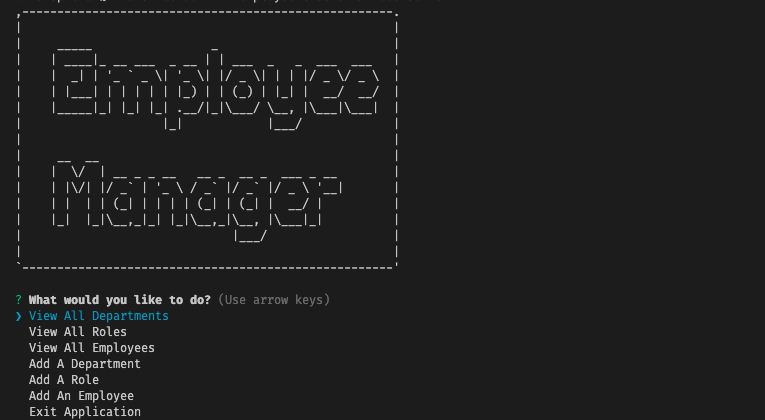
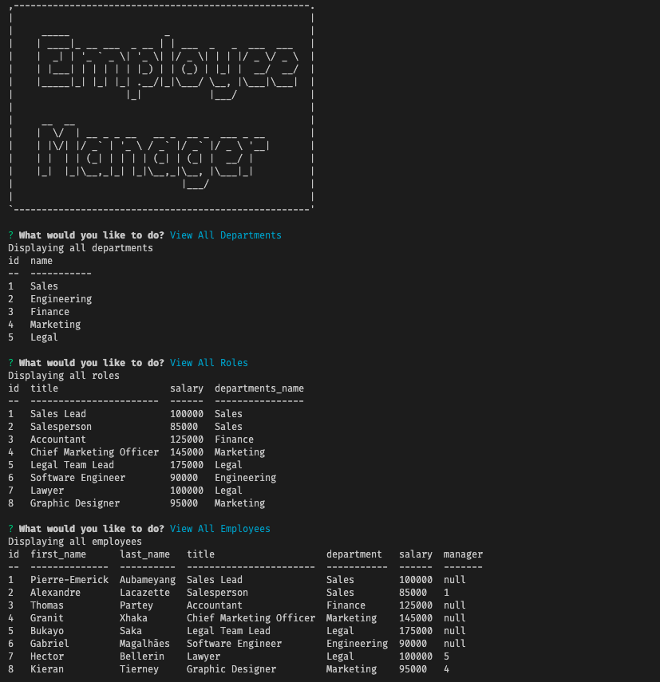

# Employee Tracker Application

## Description
As a business owner, the user wants to be able to view and manage the departments, roles, and employees in the company so that they can be organized and plan their business

## Table of Contents
* [Technologies](#technologies)
* [Mockups](#mockups)
* [Requirements](#requirements)
* [Links](#links)

## Technologies
1. MySQL
2. Inquirer
3. Javascript

## Mockups

## Requirements
1. When the user wants to use the Employee Tracker application through the command line, they start the app by running node server.js
2. User is given a welcome screen with prompts to:
    * View All Departments
    * View All Roles
    * View All Employees
    * Add A Department
    * Add A Role
    * Add An Employee
    * Exit Application
3. When the user clicks each of the first three options they are presented with a formatted table of departments, roles and employees
4. When the user adds a department, role or an employee, they are told that it was successful and that they can check the first queries to see the full tables again.

## Links
* [Employee Tracker App Walkthrough Video](https://drive.google.com/file/d/1Kp_sTz9iBzYUARztgG91Ldj5jMLC9Sfz/view?usp=sharing)
* [Employee Tracker App Repository](https://github.com/bspiewak6/employee-tracker)
